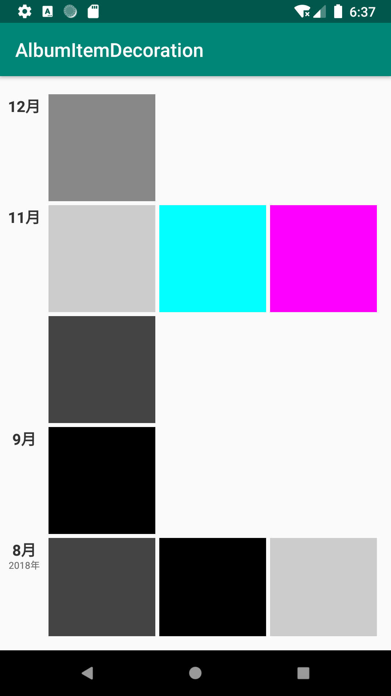

[](https://jitpack.io/#and-fast/item-decoration-group)

# ItemDecorationGroup
利用ItemDecoration完成各种效果


```implementation 'com.github.and-fast:item-decoration-group:${last-version}'```

### 相册图片效果
```
mRecyclerView.addItemDecoration(new AlbumItemDecoration(mRecyclerView));
```
<div align=left>
    
</div>
